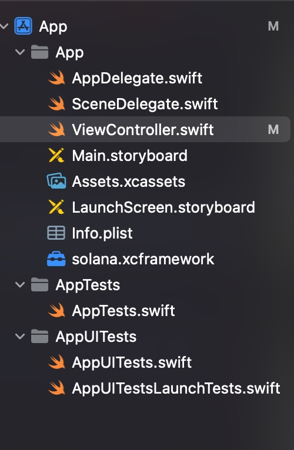

# Kotlin Multiplatform SDK for Solana (KMP)

## Overview

Welcome to the Kotlin Multiplatform SDK for Solana! This SDK leverages the power of Kotlin Multiplatform to enable developers to work with Solana blockchain across various platforms including Android, iOS Ecosystem, and the JVM. Utilizing this SDK, developers can create transactions, sign them using various signer modules, and interact with Solana through RPC calls with ease.


## Features

- **Cross-Platform**: Use a single codebase to target Android, iOS Ecosystem, and JVM.
- **Create Transactions**: Construct and manage Solana transactions with ease.
- **Sign with Signer**: Safely and securely sign your transactions with a robust signer module.
- **Interact with RPC**: Facilitate communication with the Solana blockchain through RPC calls. With a powerful serialization capabilities.
- **Metaplex Read API**: Supports the Metaplex Read API extra rpc calls
- **Keypair Generator**: Generate an EDDSA keypairs

## Getting Started

### Prerequisites

Ensure you have the Kotlin Multiplatform development environment set up. Refer to the [Kotlin Multiplatform documentation](https://kotlinlang.org/docs/multiplatform.html) to set up your environment.


### Modules

We do support composability. Each module can be used alone or by referencing the main `solana` module. The modules we support:

- `:solana:` This module provides functionality and utilities for the Solana blockchain platform. This is the main module, and might be the only one you need to build on top. It exposes all the modules required to interact with solana.

- `:solanapublickeys:` This module handles public keys within the Solana ecosystem.

- `:base58:` This module encodes and decodes data in Base58 format.

- `:solanaeddsa:` This module deals with Elliptic Curve Digital Signature Algorithm (EdDSA) cryptography specific to Solana. It also provides Keypair generation. Its the want you need if you need to generate a Offline Random Keypair.

- `:amount:` This module is used for managing numeric values, potentially within the context of financial transactions or cryptocurrency amounts. For example `lamports` or `sol`

- `:readapi:` This module is designed to consume Metaplex DAS Read API. Check the [documentation](https://github.com/metaplex-foundation/api-specifications).

- `:rpc:` This module provides functionality for making remote procedure calls (RPC) to interact with a blockchain Solana network.

- `:signer:` This module handles cryptographic signing and verifying operations, often used for secure transactions and authentication. Its just an interface.

- `:mplbubblegum:` The purpose of this module is to mint and interact with compressed NFTs.

- `:mpltokenmetadata:` The purpose of this module is to interact with Metaplex Token Metadata program. 

### Installation

#### KMP
Import the SDK into your Kotlin Multiplatform project by adding the following dependency to your build.gradle.kts:

```kotlin
implementation("foundation.metaplex:solana:$Version")
```

Our SDK is architecturally composable, allowing you to install only the dependencies necessary for your specific use case, which keeps your application optimized and resource-efficient. The library modules are available on **Maven**, facilitating easy integration into your Kotlin project.

For those focusing on RPC calling, you can choose to exclusively install modules pertinent to RPC interactions, promoting a clean and efficient codebase. Refer to our module documentation to understand the diverse range of modules available and how to selectively integrate them based on your requirements. This strategy ensures a lean development process, affording you the convenience of using only the tools you need, without the encumbrance of extraneous features.

```kotlin
implementation("foundation.metaplex:rpc:$Version")
```

Refer to the modules names to reference them individualy.

#### Android

Import the SDK into your Android project by adding the following dependency to your build.gradle.kts:

```kotlin
implementation("foundation.metaplex:solana:$Version")
```

#### iOS/MacOS in Xcode

By using KMP we got iOS/MacOs for free. We think that KMP is the future of developing solana sdks since it solves the performance problem and makes a good enough sdk for swift. Its far better than a RN or flutter counterparts since it uses actual Native Code.

Its important to notice that the fat binary is not swift-first. You can still use [pure swift sdk](https://github.com/metaplex-foundation/Solana.Swift). But progress is coming along KMP that I am confident that this version will become the more complete version.

This libraries prebuilds and deploys xcframeworks (fat binaries). To use them you can check the [release section and download](https://github.com/metaplex-foundation/solana-kmp/releases) the one you need. 

They are provided in zip format. When unzipped a fat binary is available. Just drag and drop it in your Xcode Project. It can be possible to use it with SPM.  Currently we dont provide sha256 hashes.

Using `solana.xcframework` maybe sufficient for most projects.

[](images/xcframework-navigation.jpg)

If you don`t trust the prebuilds you are allow to build them locally. By running this gradle command from android studio. This will take some time to build.

```./gradlew buildReleaseXCFramework```

or for specific module

```./gradlew solana:buildReleaseXCFramework```

### Usage

#### RPC

RPC a provide the implementation for the RpcInterface. Its possible to call the most important rpc calls. First we need to configure the RPC endpoints.

##### Koltin 
```kotlin
val rpcUrl: String = "https://api.mainnet-beta.solana.com"
val rpc = RPC(rpcUrl)
```

##### Swift 
```swift
let rpcURL = "https://api.mainnet-beta.solana.com"
let driver = NetworkDriver(httpClient: NetworkingClientKt.NetworkClient())
let rpc = RPC(
    rpcUrl: rpcURL,
    httpNetworkDriver: driver
)
```

This is how to make a `getSlot` rpc call:

##### Koltin 
```kotlin
val slot = rpc.getSlot(null)
```

##### Swift 
```swift
// await/async
let slot = await rpc.getSlot(configuration: nil)

// closure
rpc.getSlot(configuration: nil) { slot, error in
    debugPrint("\(slot!)")
}
```


##### GetAccountInfo Example

```kotlin
val randomPublicKey = PublicKey("9VHphpWFmUxVHxzWyeYJYYbQADWZ7X6PLzyWER8Lc3k2")

val rpc = RPC(rpcUrl)
val metadata = rpc.getAccountInfo(
    randomPublicKey,
    null,
    serializer = BorshAsBase64JsonArraySerializer(
        Metadata.serializer()
    )
)?.data
```

##### Interface

This is the RPC interface. Its possible to implement and alternative Interface. 

```kotlin
interface RpcInterface {

    suspend fun <T> getAccountInfo(
        publicKey: PublicKey,
        configuration: RpcGetAccountInfoConfiguration?,
        serializer: KSerializer<T>,
    ): Account<T>?

    suspend fun <T> getMultipleAccounts(
        publicKeys: List<PublicKey>,
        configuration: RpcGetMultipleAccountsConfiguration?,
        serializer: KSerializer<T>,
    ): List<Account<T>?>?

    suspend fun <T> getProgramAccounts(
        programId: PublicKey,
        configuration: RpcGetProgramAccountsConfiguration?,
        serializer: KSerializer<T>
    ): List<Account<T>?>?

    suspend fun getLatestBlockhash(
        configuration: RpcGetLatestBlockhashConfiguration?
    ): BlockhashWithExpiryBlockHeight

    suspend fun getSlot(
        configuration: RpcGetSlotConfiguration?
    ): ULong

    suspend fun getMinimumBalanceForRentExemption(
        usize: ULong
    ): ULong

    suspend fun requestAirdrop(
        configuration: RpcRequestAirdropConfiguration
    ): TransactionSignature

    suspend fun getBalance(
        publicKey: PublicKey,
        configuration: RpcGetBalanceConfiguration?
    ): Long

    suspend fun sendTransaction(
        transaction: SerializedTransaction,
        configuration: RpcSendTransactionConfiguration?
    ): TransactionSignature
}
```

#### Transactions

Create transactions using the TransactionBuilder class which facilitates the creation of Solana transactions in a Kotlin-friendly way.

##### Kotlin 
```kotlin
val memo = "Other Test memo"
val transaction: Transaction = SolanaTransactionBuilder()
    .addInstruction(
        writeUtf8(
            signer().publicKey,
                memo
            )
        )
    .setRecentBlockHash("Eit7RCyhUixAe2hGBS8oqnw59QK3kgMMjfLME5bm9wRn")
    .setSigners(listOf(signer()))
    .build()
```

##### Swift 
```swift
let memo = "Other Test memo"
let memoInstruction = MemoProgram.shared.writeUtf8(
    account: signer().publicKey, 
    memo: memo
)
let transaction: = SolanaTransactionBuilder()
    .addInstruction(
        transactionInstruction: 
            memoInstruction
    )
    .setRecentBlockHash(recentBlockHash: "BlockHash")
    .setSigners(signers: [signer()])
    .build()
```

#### Signing a Transaction

Use the signer module to securely sign your transactions with the necessary credentials:

##### Kotlin 
```kotlin
class SolanaKeypair(
    override val publicKey: PublicKey,
    override val secretKey: ByteArray
) : Keypair

class HotSigner(private val keyPair: Keypair) : Signer {
    override val publicKey: PublicKey = keyPair.publicKey
    override suspend fun signMessage(message: ByteArray): ByteArray = SolanaEddsa.sign(message, keyPair)
}
```
##### Swift
```swift
class SolanaKeypair: Keypair {
    var publicKey: PublicKey
    var secretKey: KotlinByteArray

    init(publicKey: PublicKey, secretKey: KotlinByteArray) {
        self.publicKey = publicKey
        self.secretKey = secretKey
    }
}

class HotSigner: Signer {
    private let keypair: Keypair
    init(keypair: Keypair) {
        self.keypair = keypair
    }
    func signMessage(message: KotlinByteArray) async throws -> KotlinByteArray {
        return try await SolanaEddsa.companion.sign(message: message, keypair: self.keypair)
    }
    
    var publicKey: PublicKey {
        self.keypair.publicKey
    }
}
```

### License
This project is licensed under the Metaplex License. See the [LICENSE](LICENSE.txt) file for details.

